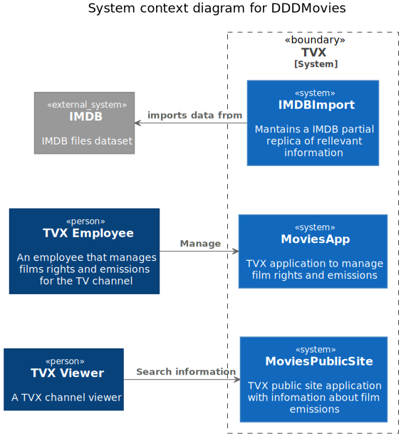
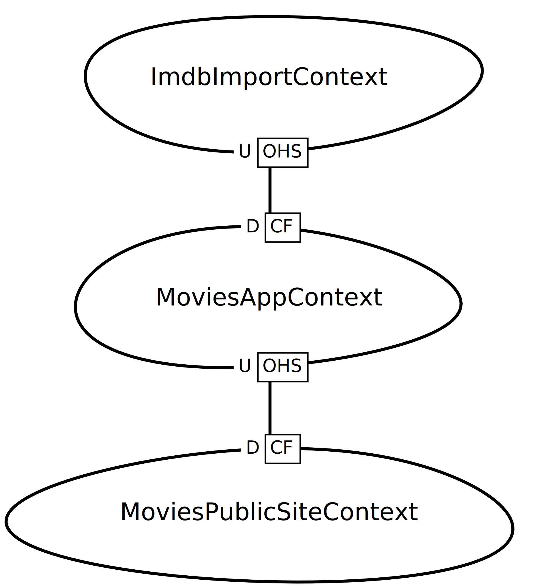

# ddd-movies

By now a just created project to learn/play with some architecture concepts, patterns, libraries, and tooling that I 
iterate slowly in my free time.

The main objective is practicing/improving Domain Driven Design with clear bounded contexts, CQRS, and Event sourcing.
Secondary areas of interest are: Static code analysis, active documentation integrated into code, CI/CD   

**Note**: As this is a learning project some things can be overengineered or a little forced in the purpose of experiment with something.
Or on the other way simplified to not invest too much time on them. 
Also, different alternatives of tools can be used in different BCs for the sole purpose of experimenting with both.

## System Context
The project possibly is not very realistic but simulates the needs of a TV channel related to purchased movies rights,
it's on-air emissions, information from those movies and public site for spectators

[Source](diagrams/system_context.puml)

The application is structured in three different bounded contexts:

- IMDBImport : Maintains a local copy of IMDB relevant data and a simple admin UI interface to query it and control import.
Its main use case is to expose IMDB data to other BCs.
- MoviesApp : Core domain application where employees can manage purchased film rights and it's emissions. Obtains data  
Obtains data about films from IMDBImport BC.
- MoviesPublicSite: Public site for TV channel spectators where can check movies that TV channel has or had righted and
it's previous and future emissions

## Context Mapping
[Context map](https://contextmapper.org/docs/context-map/) diagram with bounded context relationships:

[Source](diagrams/contextmap.cml)

Legend:
- OHS: [Open Host Service](https://contextmapper.org/docs/open-host-service/)
- CF: [Conformist](https://contextmapper.org/docs/conformist/)
- U/D [Upstream/Downstream](https://contextmapper.org/docs/context-map/) 